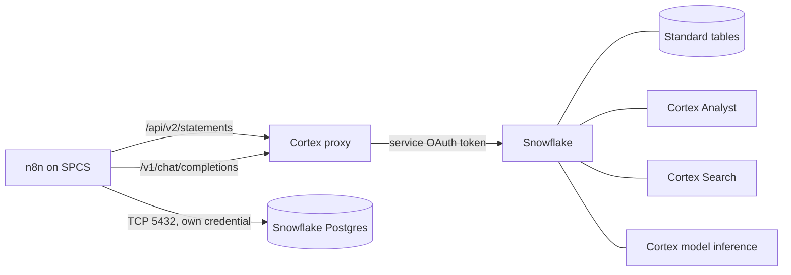

# Building Workflows Against Every Snowflake Capability

This is the practical guide to using n8n as a client for the whole Snowflake platform:
model inference, agents, semantic querying, document retrieval and both kinds of
storage. Every pattern here has been run end to end on a real deployment; the
pitfalls sections describe failures that actually happened, not hypotheticals.

For a single workflow that exercises all of it, see
[`examples/memory-tour`](../examples/memory-tour).

## The one rule that shapes everything

**Snowflake forbids programmatic access tokens from inside an SPCS container.** A bearer
PAT is rejected with:

```
Authorization failed - please check your credentials
Error connecting to Snowflake via Snowpark Container Services.
Please use OAuth when connecting to Snowflake.
```

This is architectural, not a misconfiguration: it is not a network policy problem, not an
expired token, not an n8n bug. Inside the cluster the only credential that works is the
service OAuth token at `/snowflake/session/token`, which a container cannot hand to n8n's
HTTP node in a usable way.

That is why the [Cortex proxy](cortex-proxy.md) exists. It reads the service token on
every request and exposes three doors:

| Door | What goes through it |
|---|---|
| `POST /api/v2/statements` | every SQL statement: DML, Cortex Analyst, Cortex Search, AI functions |
| `POST /v1/chat/completions` | model inference for any OpenAI-compatible n8n node |
| `GET /v1/models` | the model dropdown in the n8n credential |

Two consequences worth internalising before you design anything:

- **Cortex REST APIs other than chat completions are not reachable.** The proxy whitelists
  exact paths, so `/api/v2/cortex/analyst/message` and the Cortex Search REST endpoint are
  closed. Both capabilities are still fully available — through SQL, as shown below.
- **Snowflake Postgres does not use the proxy at all.** It is a normal Postgres endpoint
  with its own credential, reached by n8n's native Postgres node over TCP.



## Storage 1: standard tables

Standard tables are reached with SQL over the proxy. Read and write are the same node type
with a different statement.

**Always use parameter binding.** Concatenating values into the statement fails with
`HTTP 422` the moment a value contains an apostrophe, and it is the only safe way to pass
text produced by a model or by an end user.

HTTP Request node, `POST` to `http://<proxy-dns-name>:8080/api/v2/statements`, JSON body:

```javascript
{{ JSON.stringify({
  statement: "INSERT INTO MY_DB.MY_SCHEMA.TICKETS (TICKET_ID, SITE, NOTE) SELECT ?, ?, ?",
  timeout: 120,
  database: 'MY_DB', schema: 'MY_SCHEMA',
  warehouse: 'MY_WH', role: 'MY_ROLE',
  bindings: {
    '1': { type: 'TEXT', value: $json.ticket_id },
    '2': { type: 'TEXT', value: $json.site },
    '3': { type: 'TEXT', value: $json.note }
  }
}) }}
```

Binding types that matter: `TEXT` for strings, `REAL` for floats, `FIXED` for integers,
`BOOLEAN`, `DATE`, `TIMESTAMP_NTZ`. Values are always sent as strings.

Reading is the same shape with a `SELECT`. The response carries rows in `data`, as an array
of arrays of strings, and the column names in `resultSetMetaData.rowType`:

```javascript
const rows = $input.first().json.data || [];
const columns = ($input.first().json.resultSetMetaData?.rowType || []).map((c) => c.name);
return rows.map((row) => ({
  json: Object.fromEntries(columns.map((name, index) => [name, row[index]])),
}));
```

Notes on the statement body:

- `role` matters. The proxy runs as the service owner; naming the role explicitly avoids
  surprises when the default role cannot see your objects.
- A suspended warehouse resumes on the first statement, so the first call of the day pays a
  20 to 30 second cold start. Give the node a generous timeout.
- Multi-statement requests need `parameters: { MULTI_STATEMENT_COUNT: '0' }`. Prefer one
  statement per node: failures are then attributable to a node in the n8n UI.
- `TRUNCATE` and other DDL work exactly the same way. If you fan out two DML nodes in
  parallel onto the same table, serialise them: parallel branches on one table produce
  race conditions that are painful to debug.

## Storage 2: Snowflake Postgres

Use Postgres when you need row-level transactional behaviour, `RETURNING`, sequences,
upserts on a primary key, or simply a familiar OLTP surface for application state. Use
standard tables when the data is analytical, must join with the rest of the warehouse, or
must be readable by Cortex Analyst.

Setup, once:

1. Create the instance and attach a network policy. Without a policy the instance accepts
   no connections at all.
2. Add `<instance-host>:5432` to the egress network rule referenced by the external access
   integration attached to the n8n service. This is a value-list change on an existing
   rule: it takes effect without restarting n8n. **If you forget it, the symptom is a
   connection timeout, not an authentication error** — that is the first place to look.
3. Store the `application` role password in a Snowflake Secret and in the n8n Postgres
   credential. Use SSL with certificate verification disabled, which is what the platform
   expects.

The application password is displayed **once**, by `CREATE POSTGRES INSTANCE`, and cannot be
retrieved afterwards. If you lose it, do not recreate the instance:

```sql
ALTER POSTGRES INSTANCE my_instance RESET ACCESS FOR 'application';
```

After that, the native Postgres node does everything: `executeQuery` with DDL, DML and
`RETURNING`. Let the workflow own its schema with idempotent DDL, so there is no manual
setup step:

```sql
CREATE TABLE IF NOT EXISTS demo_events (
  event_id   BIGSERIAL PRIMARY KEY,
  run_id     TEXT NOT NULL,
  status     TEXT,
  created_at TIMESTAMPTZ NOT NULL DEFAULT NOW()
);
```

Fields that mix literal SQL with an n8n expression need a leading `=` on the parameter, or
the expression is sent to Postgres verbatim as text.

Hybrid tables are out of scope for this guide: they are reached over the SQL API exactly
like standard tables, with no special handling, but the patterns here have not been
exercised against them.

## Cortex Analyst: natural-language questions over your tables

Analyst turns a question into SQL against a **semantic view**, which is what gives it the
business vocabulary it needs. Its REST API is not reachable through the proxy, so it is
called as SQL, wrapped in a Cortex Agent.

Build it in three steps.

**1. A semantic view.** Dimensions for the things people filter and group by, facts for
the raw numeric columns, metrics for the aggregations. Synonyms are not decoration: they
are how a question phrased in the user's words finds your column.

```sql
CREATE OR REPLACE SEMANTIC VIEW MY_DB.MY_SCHEMA.TICKETS_ANALYTICS
  TABLES (
    tickets AS MY_DB.MY_SCHEMA.TICKETS
      PRIMARY KEY (TICKET_ID)
      WITH SYNONYMS ('tickets', 'work orders')
  )
  FACTS ( tickets.sentiment AS SENTIMENT_SCORE )
  DIMENSIONS (
    tickets.site AS SITE WITH SYNONYMS ('plant', 'location'),
    tickets.status AS STATUS WITH SYNONYMS ('state'),
    tickets.created_date AS TO_DATE(CREATED_AT) WITH SYNONYMS ('day', 'date')
  )
  METRICS (
    tickets.ticket_count AS COUNT(tickets.ticket_id)
      WITH SYNONYMS ('number of tickets', 'volume'),
    tickets.avg_sentiment AS AVG(tickets.sentiment)
  );
```

Verify it answers before wiring anything else:

```sql
SELECT * FROM SEMANTIC_VIEW(
  MY_DB.MY_SCHEMA.TICKETS_ANALYTICS
  METRICS tickets.ticket_count DIMENSIONS tickets.site
);
```

**2. An agent with the Analyst tool.** Deploy it from YAML rather than hand-written DDL:

```yaml
models:
  orchestration: auto
instructions:
  system: 'You answer questions about tickets by querying the semantic view, never from memory.'
  response: 'Be concise. Always state the numbers and how they are grouped.'
tools:
  - tool_spec:
      type: "cortex_analyst_text_to_sql"   # the "_text_to_sql" suffix is required
      name: "tickets_analytics"
      description: "Query tickets: counts, status, site, sentiment"
tool_resources:
  tickets_analytics:
    execution_environment:
      type: "warehouse"
      warehouse: "MY_WH"
    semantic_view: "MY_DB.MY_SCHEMA.TICKETS_ANALYTICS"   # not semantic_model
```

```bash
cortex agent-studio agent-deploy --file-path agent.yaml \
  --fqn MY_DB.MY_SCHEMA.MY_AGENT
```

**3. Call it from n8n** with `DATA_AGENT_RUN`, binding both arguments:

```javascript
{{ JSON.stringify({
  statement: 'SELECT SNOWFLAKE.CORTEX.DATA_AGENT_RUN(?, ?) AS RESPONSE',
  timeout: 300,
  database: 'MY_DB', schema: 'MY_SCHEMA', warehouse: 'MY_WH', role: 'MY_ROLE',
  bindings: {
    '1': { type: 'TEXT', value: 'MY_DB.MY_SCHEMA.MY_AGENT' },
    '2': { type: 'TEXT', value: JSON.stringify({ messages: [ { role: 'user',
           content: [ { type: 'text', text: $json.question } ] } ] }) }
  }
}) }}
```

The answer is nested twice: the SQL API wraps the row, and the cell holds a JSON document
whose `content` array carries the text blocks. Take the last text block:

```javascript
const raw = ($input.first().json.data || [[null]])[0][0];
const parsed = JSON.parse(raw);
const texts = (parsed.content || [])
  .filter((block) => block.type === 'text' && block.text)
  .map((block) => block.text.trim())
  .filter((text) => text.length > 0);
const answer = texts.length ? texts[texts.length - 1] : '';
```

Two practical warnings:

- **Validate loosely.** Analyst output is non-deterministic prose. Assert that a number or
  a known label appears; never assert on an exact string.
- **Ask one thing at a time.** A prompt bundling two questions frequently comes back
  answering only one. Numbering them explicitly ("Answer both questions in order. First
  ... Second ...") is what made it reliable.

## Cortex Search: retrieval over documents

Cortex Search also has a SQL entry point, so it needs no REST access:

```javascript
{{ JSON.stringify({
  statement: 'SELECT SNOWFLAKE.CORTEX.SEARCH_PREVIEW(?, ?) AS RESULTS',
  timeout: 180,
  database: 'MY_DB', schema: 'MY_SCHEMA', warehouse: 'MY_WH', role: 'MY_ROLE',
  bindings: {
    '1': { type: 'TEXT', value: 'MY_DB.MY_SCHEMA.DOC_SEARCH' },
    '2': { type: 'TEXT', value: JSON.stringify({
             query: $json.question,
             columns: ['DOC_ID', 'TITLE', 'CHUNK', 'SOURCE'],
             filter: { '@eq': { SOURCE: 'safety_bulletin' } },
             limit: 3 }) }
  }
}) }}
```

The single returned cell is a JSON string; each hit carries the requested columns plus
`@scores` with `cosine_similarity`, `reranker_score` and `text_match`.

**Only columns declared as `ATTRIBUTES` can be filtered on.** Decide them at creation time:

```sql
CREATE OR REPLACE CORTEX SEARCH SERVICE MY_DB.MY_SCHEMA.DOC_SEARCH
  ON CHUNK
  ATTRIBUTES DOC_ID, SOURCE, RUN_ID
  WAREHOUSE = MY_WH
  TARGET_LAG = '1 minute'
  AS SELECT DOC_ID, TITLE, CHUNK, SOURCE, RUN_ID FROM MY_DB.MY_SCHEMA.DOCS;
```

**`TARGET_LAG` is the freshness contract, and it is the thing that surprises people.** A
document inserted now is not searchable until the service refreshes. If a workflow writes
a document and reads it back in the same run, the lag must be shorter than the workflow and
you still need to wait it out; a one minute lag with a 70 second Wait node works. Long lags
are cheaper: pick the largest value your use case tolerates.

When you write and read back in one run, filter on your own identifier. Otherwise a
semantically similar document from an earlier run outranks the one you just wrote, and a
demo that looks broken is actually working correctly.

## Model inference: LLMs served by Snowflake

Any n8n node that speaks OpenAI can run on Cortex-served models. Create a credential of
type **OpenAI**:

- **Base URL**: `http://<proxy-dns-name>:8080/v1` — get the DNS name from
  `SHOW SERVICES LIKE 'CORTEX_PROXY_SERVICE'`, column `dns_name`.
- **API Key**: any placeholder. The proxy authenticates with the service OAuth token and
  ignores this field, so **no secret is stored in n8n**.

On the chat model node:

- Pick the model from the list, populated by `GET /v1/models`.
- **Turn "Use Responses API" off.** The proxy implements `/v1/chat/completions` only; with
  the Responses API enabled the node calls `/v1/responses` and fails.

Prompts, data and answers never leave Snowflake. There is no third-party API key anywhere
in the workflow.

The model catalog is a file on a stage, mounted into the service and re-read without a
rebuild, so adding a model is a file upload. Two fields describe tool-calling limits:

- `tools_unsupported`: models that cannot do tool calling at all. Small open-weight models
  are typically here, which matters because **the AI Agent node requires tool calling**.
- `tools_require_reasoning_effort_none`: models that reject a request carrying `tools`
  unless `reasoning_effort` is explicitly `"none"`. The proxy sets it for them and also
  retries adaptively on that error message, so an unlisted future model still works.

Never add a model name you have not called. A wrong name returns `HTTP 400 unknown model`,
which clients often surface as something misleading such as a context-length error.

For single-shot classification, extraction or summarisation over rows you already have in
Snowflake, consider skipping inference in n8n entirely and using an AI function in SQL:

```sql
SELECT AI_COMPLETE('claude-sonnet-5', 'Summarise: ' || NOTE) FROM MY_DB.MY_SCHEMA.TICKETS;
```

That keeps the data and the compute together and costs one HTTP call for the whole batch
instead of one per row.

## Agents: two kinds, and when to use which

**Snowflake-side Cortex Agents** are called with `DATA_AGENT_RUN` as shown above. The
orchestration, the tools and the instructions live in Snowflake, so every client gets the
same behaviour and the governance story is simple. Give an agent several tools — Analyst
plus Search — and it will route between them itself. Prefer this when the reasoning belongs
to the data platform.

**n8n-side AI Agents** put the orchestration in the workflow, which is what you want when
the agent has to reach things Snowflake cannot: a Postgres instance, an internal HTTP API,
a Slack message, a file. Wire it as:

- **Chat Model**: the OpenAI credential pointed at the proxy.
- **Memory**: Simple Memory. Its default session key reads `$json.sessionId`, which only
  exists downstream of a chat trigger, so in a non-chat workflow set `sessionIdType` to a
  custom key — a run identifier works well.
- **Tools**: use the **tool variants of regular nodes**, `n8n-nodes-base.httpRequestTool`
  and `n8n-nodes-base.postgresTool`. On current n8n the langchain tool nodes such as
  `@n8n/n8n-nodes-langchain.toolHttpRequest` fail with *"has a 'supplyData' method but no
  'execute' method"*.

Arguments come from the model with `$fromAI`, and they can still travel as bound
parameters, so a model-authored question never becomes SQL text:

```javascript
{{ JSON.stringify({
  statement: 'SELECT SNOWFLAKE.CORTEX.SEARCH_PREVIEW(?, ?) AS RESULTS',
  database: 'MY_DB', schema: 'MY_SCHEMA', warehouse: 'MY_WH', role: 'MY_ROLE',
  bindings: {
    '1': { type: 'TEXT', value: 'MY_DB.MY_SCHEMA.DOC_SEARCH' },
    '2': { type: 'TEXT', value: JSON.stringify({
             query: $fromAI('searchQuery', 'What to search the corpus for', 'string'),
             columns: ['TITLE', 'CHUNK'], limit: 2 }) }
  }
}) }}
```

Give tools names and descriptions a stranger could act on, and instruct the agent to answer
only from tool output and to name the tool behind each figure. That single instruction turns
an unverifiable answer into one you can audit — and when a tool fails, the agent says so
instead of inventing a number.

**Parallel tool calls are handled for you, and you should know why.** An agent with more
than one tool will emit several tool calls in a single turn. Cortex puts each `tool` message
in its own turn, so that request arrives with one `toolResult` for N `toolUse` blocks and is
rejected with a non-retryable `HTTP 400`; because the rejected turn stays in the history,
the session is broken from then on. The proxy collapses those turns, keeping every tool
result. The visible effect is that tools execute across successive turns rather than
simultaneously. Details in [cortex-proxy.md](cortex-proxy.md).

## Choosing between the options

| Need | Use |
|---|---|
| Analytical data, joins with the warehouse | standard table over the SQL API |
| Transactional state, `RETURNING`, upserts, sequences | Snowflake Postgres, native node |
| A business question in the user's own words | Cortex Analyst through an agent |
| Finding the right passage in documents | Cortex Search |
| Classifying or summarising many rows | AI functions in SQL, not per-row inference |
| One free-form generation step in a workflow | chat model node on the proxy |
| Reasoning that stays inside the data platform | Cortex Agent with `DATA_AGENT_RUN` |
| Reasoning that must touch systems outside Snowflake | n8n AI Agent with tool nodes |

## n8n mechanics that will cost you an hour

- **Two adjacent closing braces end an expression.** A nested object literal inside
  `{{ }}` that produces `}}` fails with `ExpressionError: invalid syntax` before the node
  runs. Write `} }`.
- **Mixing literal text and an expression in one field needs a leading `=`.** Without it
  the `{{ }}` is passed through as text. This one is caught by workflow validation rather
  than at runtime.
- **A Manual Trigger cannot be started through the API.** Add a webhook trigger alongside
  it if you want to run the workflow from a test harness or another system.
- **A webhook answers when the execution suspends.** With a Wait node in the path, the HTTP
  response is whatever was available at that moment, not the final result. Poll the
  execution, or keep the wait out of the request path.
- **Validate before running.** Workflow validation catches expression-format and connection
  mistakes in a second, where a run costs you a warehouse resume and a search lag.

## Error handling

Set the workflow's error handler to itself, add an Error Trigger, and write failures to a
table so a failed run leaves evidence:

```javascript
{{ JSON.stringify({
  statement: "INSERT INTO MY_DB.MY_SCHEMA.RUN_LOG (RUN_ID, WORKFLOW, NODE, MESSAGE) SELECT ?, ?, ?, ?",
  database: 'MY_DB', schema: 'MY_SCHEMA', warehouse: 'MY_WH', role: 'MY_ROLE',
  bindings: {
    '1': { type: 'TEXT', value: String($json.execution?.id) },
    '2': { type: 'TEXT', value: $json.workflow?.name },
    '3': { type: 'TEXT', value: $json.execution?.lastNodeExecuted },
    '4': { type: 'TEXT', value: String($json.execution?.error?.message).slice(0, 900) }
  }
}) }}
```

The Error Trigger fires only if the workflow's `errorWorkflow` setting points at the
workflow itself.
